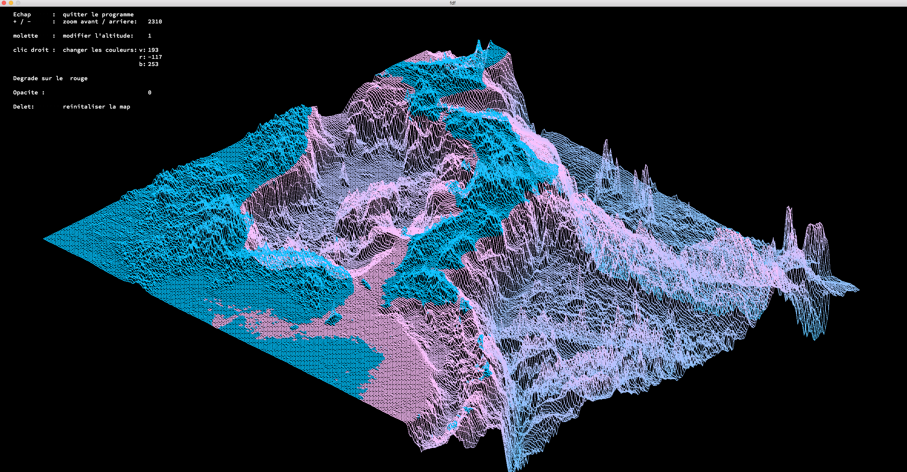
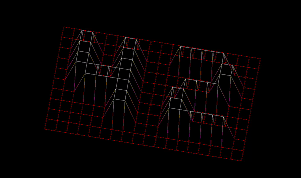

# Fil de fer (FdF)
> The graphical project to represent a landscape as a 3D object [Subject](en.subject.pdf) \
> Status: Finished



Table of contents
=================

<!--ts-->
   * [About the project](#About)
   * [Installation](#Installation)
   * [Structure of the project](#Structure-of-the-project)
   * [Code overview](#Code-overview)
        * [General structure](#General-structure)
        * [MLX management](#MLX-management)
        * [3D to 2D transformation](#3d-to-2d-transformation)
        * [Drawing a line](#Drawing-a-line)
        * [Double level gradient color](#Double-level-gradient-color)
        * [Rotation Management](#Rotation-Management)
   * [Keyboard](#Keyboard)
   * [Result](#Results)

<!--te-->
<br> </br>

About 
=====

#### End product:
- Create controllable 2-d representation of 3-d object
#### Features:
- Show the 3d object
- Zoom in and out
- Translate the model
- Rotate the model
- Add one more bonus (color change)
#### Requirements:
- We have to use the MiniLibx and math library
- Take a map as an input
- Use isometric projection for transforming 2d → 3d
- The management of the window must remain smooth
- ESC and cross button

> <i>[Back to top](#table-of-contents)</i>

<br></br>

Installation
============

Clone repository, then 
```bash
$ make
$ ./fdf maps/42.fdf
```
> <i>[Back to top](#table-of-contents)</i>

<br></br>


Structure of the code
=====================
    .
    ├── mlx_linux				    # Graphic library
    |── libft					    # Previously saved function
    |── headers
    |── srcs
    |    ├── main.c				    # All big stages of the code  
    |    ├── ft_parsing.c			# Parsing and preprocessing
    |    |	└── parsing
    |    |		├── includes
    |    |		├── utils
    |    |		└── *.c
    |    ├── ft_rendering.c			# functions to run the render
    |    |	└── rendering
    |    |		├── includes
    |    |		├── utils
    |    |		└── *.c
    |    ├── ft_handling.c			# Control the map
    |    |	└── handling
    |    |		├── includes
    |    |		├── utils
    |    |		└── *.c
	|    └── utils
	|	    ├── ft_clean.c			
	|	    └── ft_error.c
    └── test                        # Test mlx and ideas

> <i>[Back to top](#table-of-contents)</i>

<br> </br>

Code Overview
=============

General structure
-----------------

```
./headers/ft_data.h

typedef struct s_node
{
	float		x;
	float		y;
	int			z;
	int			color;
	int			x_p;
	int			y_p;
}				t_node;     # Info about one point in the map

typedef struct s_matrix
{
	t_node		**node;
	int			height;
	int			width;
	int			z_max;
	int			z_min;
}				t_matrix;   # Info about the map

typedef struct s_data
{
	void		*mlx_ptr;
	void		*win_ptr;
	t_img		img;
	t_matrix	mtrx;
	t_param		param;
}				t_data;     # General storage
```
> <i>[Back to top](#table-of-contents)</i>

<br></br>

MLX management
--------------

```
./srcs/ft_main.c

int	main(int argc, char **argv)
{
	t_data	*my_data;

	my_data = NULL;
	ft_init(&my_data);
	ft_parsing(argc, argv, my_data);

	mlx_loop_hook(my_data->mlx_ptr, &ft_rendering, my_data);
	mlx_hook(my_data->win_ptr, KeyPress, KeyPressMask, &ft_handle_keypress, my_data);
	mlx_hook(my_data->win_ptr, DestroyNotify, NoEventMask, &ft_handle_exit, my_data);
	mlx_loop(my_data->mlx_ptr);

	ft_clean(my_data);
	return (0);
}
```
> <i>[Back to top](#table-of-contents)</i>

<br></br>

3D to 2D transformation
-----------------------

This code is the final representation of the multiplication of the 3 matrices \
(x, y, z) -> data->mtrx.node[i][j].x data->mtrx.node[i][j].y data->mtrx.node[i][j].z \
(x', y') -> data->mtrx.node[i][j].x_p data->mtrx.node[i][j].y_p 

```
 ./srcs/rendering/ft_transform.c 

void	ft_transform(t_data *data, int i, int j)
{
	float	x_p;
	float	y_p;
	int		x;
	int		y;
	int		z;

	x = data->mtrx.node[i][j].x * data->param.grid;
	y = data->mtrx.node[i][j].y * data->param.grid;
	z = data->mtrx.node[i][j].z * data->param.attitude;

	x_p = 0.0;
	x_p += x * cos(ft_rad(data->param.theta)) * cos(ft_rad(data->param.beta));
	x_p -= z * sin(ft_rad(data->param.beta));
	x_p -= y * sin(ft_rad(data->param.theta)) * cos(ft_rad(data->param.beta));
	x_p += data->param.x_offset;

	y_p = 0.0;
	y_p += x * sin(ft_rad(data->param.theta)) * cos(ft_rad(data->param.alpha));
	y_p += y * cos(ft_rad(data->param.theta)) * cos(ft_rad(data->param.alpha));
	y_p += x * cos(ft_rad(data->param.theta)) * sin(ft_rad(data->param.beta)) * sin(ft_rad(data->param.alpha));
	y_p -= y * sin(ft_rad(data->param.theta)) * sin(ft_rad(data->param.beta)) * sin(ft_rad(data->param.alpha));
	y_p += z * cos(ft_rad(data->param.beta)) * sin(ft_rad(data->param.alpha));
	y_p += data->param.y_offset;

	data->mtrx.node[i][j].x_p = (int)x_p;
	data->mtrx.node[i][j].y_p = (int)y_p;
}
```
> <i>[Back to top](#table-of-contents)</i>

<br></br>

Drawing a line
--------------

```
./srcs/rendering/ft_draw_line.c

void	bresenhams(t_data *data, t_point p1, t_point p2)
{
	t_point	p;
	int		err;
	int		e;

	p.x_p = p1.x_p;
	p.y_p = p1.y_p;
	err = ft_abs(p2.x_p, p1.x_p) - ft_abs(p2.y_p, p1.y_p);
	ft_set_colors(data, &p1, &p2);
	while (p.x_p != p2.x_p || p.y_p != p2.y_p)
	{
		ft_pixel(data, p.x_p, p.y_p, ft_color(p1, p2, p));
		e = 2 * err;
		if (e > -1 * ft_abs(p2.y_p, p1.y_p))
		{
			err -= ft_abs(p2.y_p, p1.y_p);
			p.x_p += ft_slope(p1.x_p, p2.x_p);
		}
		if (e < ft_abs(p2.x_p, p1.x_p))
		{
			err += ft_abs(p2.x_p, p1.x_p);
			p.y_p += ft_slope(p1.y_p, p2.y_p);
		}
	}
	ft_pixel(data, p.x_p, p.y_p, ft_color(p1, p2, p));
}
```
> <i>[Back to top](#table-of-contents)</i>

<br></br>

Double level gradient color
---------------------------------------

t_point   - the structure with info about the given point \
num       - num (0, 255) to calculate the gradient    
```
./srcs/rendering/utils/ft_colors_utils.c 

void	ft_set_colors_sep(t_data *data, t_point *p1)
{
	int	num;

	if (data->mtrx.node[p1->i][p1->j].color != -1)
		p1->color = data->mtrx.node[p1->i][p1->j].color;
	else
	{
		if (data->mtrx.z_max - data->mtrx.z_min == 0)
			num = 255;
		else
			num = (float)(data->mtrx.node[p1->i][p1->j].z - data->mtrx.z_min)
				/ (float)(data->mtrx.z_max - data->mtrx.z_min) * 255;

		if (data->param.color % 3 == 1 && num < 0.5 * 255)
			p1->color = create_rgb(255, num * 2, 0);
		else if (data->param.color % 3 == 1 && num >= 0.5 * 255)
			p1->color = create_rgb(255, 255, num);

		else if (data->param.color % 3 == 2 && num < 0.5 * 255)
			p1->color = create_rgb(num * 2, 0, 255);
		else if (data->param.color % 3 == 2 && num >= 0.5 * 255)
			p1->color = create_rgb(255, num, 255);

		else if (data->param.color % 3 == 0 && num < 0.5 * 255)
			p1->color = create_rgb(0, 255, num * 2);
		else
			p1->color = create_rgb(num, 255, 255);
	}
}
```
> <i>[Back to top](#table-of-contents)</i>

<br></br>

Rotation management
-------------------

In the hook, I change the parameter of the projection. Then in the \
loop_hook I draw the projection with given parameters

```
./srcs/handling/ft_keypress_utils.c

void	ft_handle_rotation(int keysym, t_data *data)
{
	if (keysym == 'a')
		data->param.beta -= 5;
	if (keysym == 'd')
		data->param.beta += 5;
	if (keysym == 'w')
		data->param.alpha += 5;
	if (keysym == 's')
		data->param.alpha -= 5;
	if (keysym == 'q')
		data->param.theta += 5;
	if (keysym == 'e')
		data->param.theta -= 5;
}
```
> <i>[Back to top](#table-of-contents)</i>

<br></br>

Keyboard
=========

- `a and d` rotate through y axes
- `w and s` rotate through x axes
- `q and e` rotate through z axes
- `u, h, j and k` move the map
- `+ and -` zoom in and out
- `z and x` change the height of the map
- `space` change the color
> <i>[Back to top](#table-of-contents)</i>

<br></br>


Results
=======



 


> <i>[Back to top](./)</i>

<br></br>
