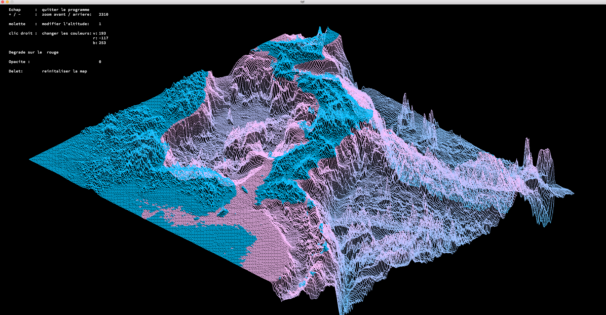

# Fil de fer (FdF). 
> The graphical project to represent a landscape as a 3D object \
> Status: Ongoing, planning phase



# About the project
#### End product:
- Create controllable 2-d representation of 3-d object
#### Features:
- Show the 3d object in 2 projections (iso + smth)
- Zoom in and out
- Translate the model
- Rotate the model
- Add one more bonus
#### Requirements:
- We have to use the MiniLibx and math library
- Take a map as an input (taking into account that map is properly formatted)
- Use isometric projection for transforming 2d → 3d
- The management of my window must remain smooth
- ESC and cross button


# Planning and pseudocode 

My data structure. I have decided to store everything in one place to create the mvp of the project. At the end I will defactorize it 
```
typedef struct s_data{

    // MLX info
    void *win;
    void *ptr;
    
    // Matrix info
    int   **matrix;
    int   mtrx_length;
    int   mtrx_height;
    
    // Scaling info
    int     alpha; 
    int     beta;
    
} t-data;
```

Main part. Here I have to have only the mlx configurations
1. Initialize my data
2. Prepare my data
    1. Parse the map
    2. Prepare the scale coefficients
3. Draw the 3d object with default configuration 
4. Allow mouse and keyboard hooks to control the object
5. Clean at the end 
```
def main():
    t_data  my_data;

    mlx_init();
    ft_prepare_the_data();

    ft_draw();
    mlx_hook_keyboard();
    mlx_hook_mouse();
    mlx_clean();
```

Ft_prepare the data
```
def ft_prepare_the_data(int argc, char **argv, t_data *my_data):
    ft_parse(argc, argv, my_data);
    ft_set_coefficients(my_data);

def ft_parse():

```
